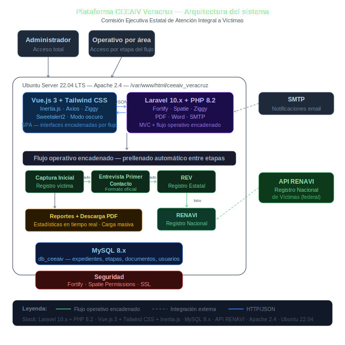

# 📋 Caso de Estudio — Plataforma CEEAIV Veracruz

> **Nota:** Este repositorio es un caso de estudio técnico. El código fuente es confidencial por acuerdo con el cliente (CEEAIV Veracruz). Se documenta la arquitectura, decisiones técnicas y alcance del proyecto con fines de referencia profesional.

---

## 🏛️ Contexto

| | |
|---|---|
| **Cliente** | Comisión Ejecutiva Estatal de Atención Integral a Víctimas de Veracruz (CEEAIV) |
| **Proyecto** | Plataforma digital para registro, control y seguimiento de víctimas de delitos federales y violaciones a derechos humanos |
| **Empresa** | Importare Software SA de CV |
| **Mi rol** | **Arquitecto de Software** — levantamiento presencial de requerimientos con múltiples áreas, diseño del flujo operativo multi-módulo, modelado de BD, maquetas, definición de stack y supervisión del equipo |
| **Período** | 2023 – 2024 |

---

## 🎯 Problema

La CEEAIV administraba el registro y seguimiento de cada caso de víctima con **documentación física**, lo que generaba:

- Ausencia total de métricas de atención y resultados
- Errores frecuentes en datos por captura manual repetida entre áreas
- Pérdida de expedientes físicos
- Imposibilidad de integrar datos históricos previos al sistema

El reto arquitectónico central: cada área de la Comisión operaba de forma aislada y el expediente de una víctima debía fluir de área en área, **prellenando automáticamente** los formatos de la siguiente etapa con la información ya capturada.

---

## ✅ Solución

Se diseñó e implementó una plataforma web con un **flujo operativo encadenado** donde cada módulo alimenta al siguiente, eliminando la captura duplicada y garantizando trazabilidad completa del expediente.

### Flujo operativo de un expediente

```
Captura Inicial
      ↓  (datos prellenados automáticamente)
Entrevista Primer Contacto
      ↓  (datos prellenados automáticamente)
Registro Estatal de Víctimas (REV)
      ↓  (integración con registro federal)
RENAVI / RENADET
      ↓
Reporte de Víctimas (PDF descargable)
```

### Módulos del sistema

**1. Captura Inicial**
- Registro de víctima con datos básicos
- Acceso a entrevista de primer contacto desde el mismo expediente

**2. Entrevista Primer Contacto**
- Datos prellenados desde Captura Inicial
- Impresión del formato oficial de entrevista
- Subida de escaneo firmado

**3. Registro Estatal de Víctimas (REV)**
- Datos prellenados desde etapas anteriores
- Cambio de estatus por etapa del proceso
- Impresión del formato oficial REV
- Acceso directo al Registro Nacional desde el mismo expediente

**4. RENAVI / RENADET**
- Integración con la **API RENAVI** (Registro Nacional de Víctimas — sistema federal)
- Registro de folios nacionales
- Sincronización bidireccional de datos

**5. Reportes y métricas**
- Reporte de víctimas con filtros avanzados
- Descarga de PDF con información completa del expediente
- Estadísticas en tiempo real con datos homologados

**6. Carga masiva**
- Mecanismo de importación de datos históricos previos al sistema

---

## 🏗️ Arquitectura



```
┌──────────────────────────────────────────────────────────────┐
│               Servidor Ubuntu 22.04 LTS                      │
│            /var/www/html/ceeaiv_veracruz                     │
│                                                              │
│  ┌───────────────────────────────────────────────────────┐  │
│  │              Laravel 10.x (Backend + MVC)             │  │
│  │                                                       │  │
│  │  • Flujo operativo encadenado multi-módulo            │  │
│  │  • Generación de formatos PDF y Word oficiales        │  │
│  │  • Integración API RENAVI (registro federal)          │  │
│  │  • Importación masiva de datos históricos             │  │
│  │  • Notificaciones vía SMTP                            │  │
│  │  • Spatie (roles/permisos) + Fortify (auth)           │  │
│  └───────────────────┬───────────────────────────────────┘  │
│                      │ Inertia.js                            │
│  ┌───────────────────▼───────────────────────────────────┐  │
│  │         Vue.js 3 + Tailwind CSS (Frontend SPA)        │  │
│  │                                                       │  │
│  │  • Interfaces encadenadas por flujo operativo         │  │
│  │  • Prellenado automático entre módulos                │  │
│  │  • Modo claro / oscuro                                │  │
│  │  • Axios · Sweetalert2 · Ziggy                        │  │
│  └───────────────────┬───────────────────────────────────┘  │
│                      │                                       │
│  ┌───────────────────▼───────────────────────────────────┐  │
│  │              MySQL 8.x (db_ceeaiv)                    │  │
│  │  Expedientes, etapas, documentos, usuarios, roles     │  │
│  └───────────────────────────────────────────────────────┘  │
└──────────────────────────────────────────────────────────────┘
                              │
              ┌───────────────▼───────────────┐
              │    API RENAVI (Federal)        │
              │  Registro Nacional de Víctimas │
              └───────────────────────────────┘
```

---

## ⚙️ Patrones de Arquitectura Implementados

**Flujo de estado encadenado (State Machine)**
El expediente de cada víctima avanza por etapas definidas — Captura Inicial → Entrevista → REV → RENAVI — con datos que fluyen automáticamente de una interfaz a la siguiente. Diseñé este flujo a partir del levantamiento presencial con cada área operativa de la Comisión.

**Monolito modular con Inertia.js**
Laravel como backend MVC y Vue.js 3 como frontend SPA, conectados mediante Inertia.js — sin API REST separada, manteniendo la simplicidad del monolito con la reactividad de Vue.

**Separación por rol operativo**
Cada perfil de usuario accede solo a las etapas del flujo que le corresponden según su área dentro de la Comisión.

---

## 🛠️ Stack Tecnológico

| Capa | Tecnología |
|---|---|
| **Backend** | PHP 8.2 / Laravel 10.x |
| **Frontend** | Vue.js 3 + Tailwind CSS + Inertia.js |
| **Base de datos** | MySQL 8.x |
| **Servidor** | Ubuntu Server 22.04 LTS + Apache 2.4 + Nginx |
| **Autenticación** | Laravel Fortify + Spatie Permissions |
| **Integración externa** | API RENAVI (Registro Nacional de Víctimas) |
| **Documentos** | Generación de PDF y formatos Word oficiales |
| **Notificaciones** | SMTP (correo electrónico) |

---

## 👥 Roles del Sistema

| Rol | Acceso |
|---|---|
| **Administrador** | Gestión de usuarios, acceso total al sistema |
| **Operativo por área** | Acceso a los módulos correspondientes a su etapa en el flujo |

---

## 📊 Impacto

- ✅ Digitalización completa de un proceso operativo previamente 100% en papel
- ✅ Eliminación de captura duplicada — cada dato se captura una sola vez y fluye al siguiente módulo
- ✅ Integración con el Registro Nacional de Víctimas (RENAVI) a nivel federal
- ✅ Generación automática de formatos oficiales (PDF y Word)
- ✅ Estadísticas en tiempo real con datos homologados — antes inexistentes
- ✅ Carga masiva de datos históricos para migrar información previa al sistema

---

## 🔑 Diferenciador Arquitectónico

El reto central de este proyecto no fue técnico sino de **análisis de negocio**: las distintas áreas de la Comisión operaban de forma aislada sin visión del proceso completo. El trabajo de levantamiento presencial con cada área me permitió identificar las conexiones entre procesos y diseñar un flujo operativo unificado donde la información capturada en un módulo prellenaba automáticamente el siguiente, reduciendo errores y tiempos de atención.

---

## 🔐 Nota de Confidencialidad

El código fuente de este proyecto es propiedad de Importare Software SA de CV y fue desarrollado bajo contrato con la CEEAIV Veracruz. No se publica por acuerdo de confidencialidad con el cliente institucional.

---

## 👤 Autor

**Cristhian Zavala**
Arquitecto de Software | Importare Software SA de CV
- 🔗 [LinkedIn](https://linkedin.com/in/cristhianszt)
- 🐙 [GitHub](https://github.com/CristhianSZT)
